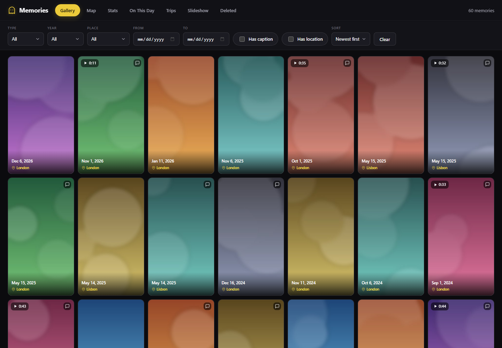
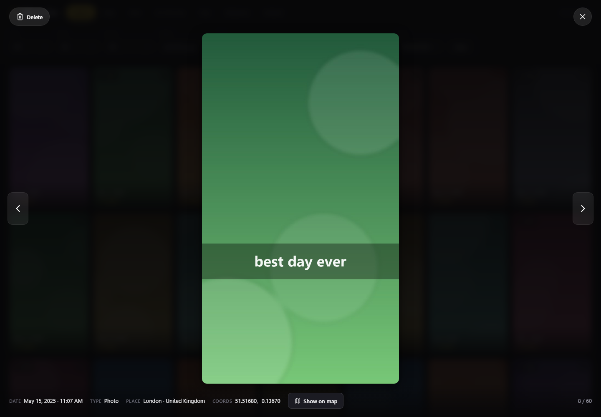
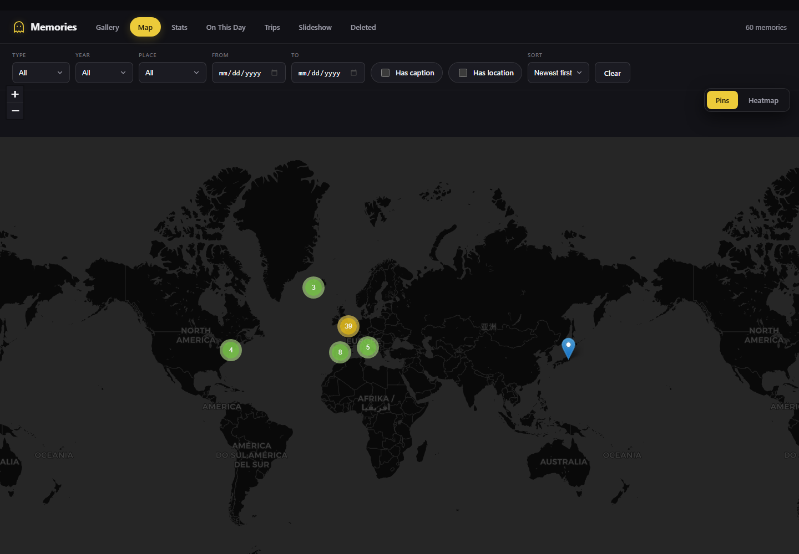
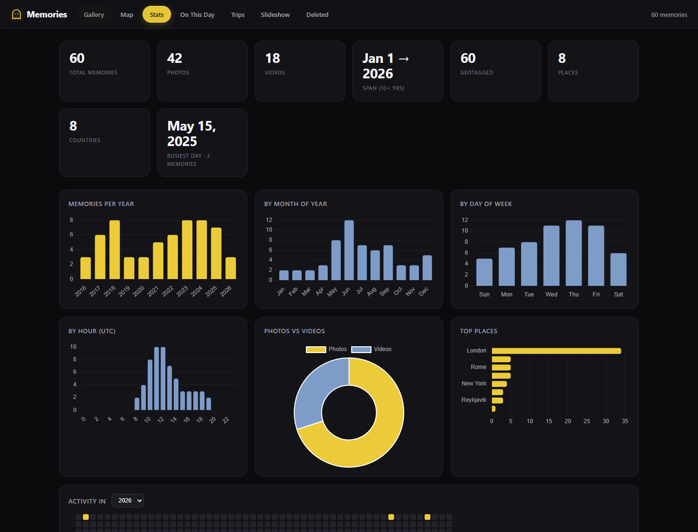
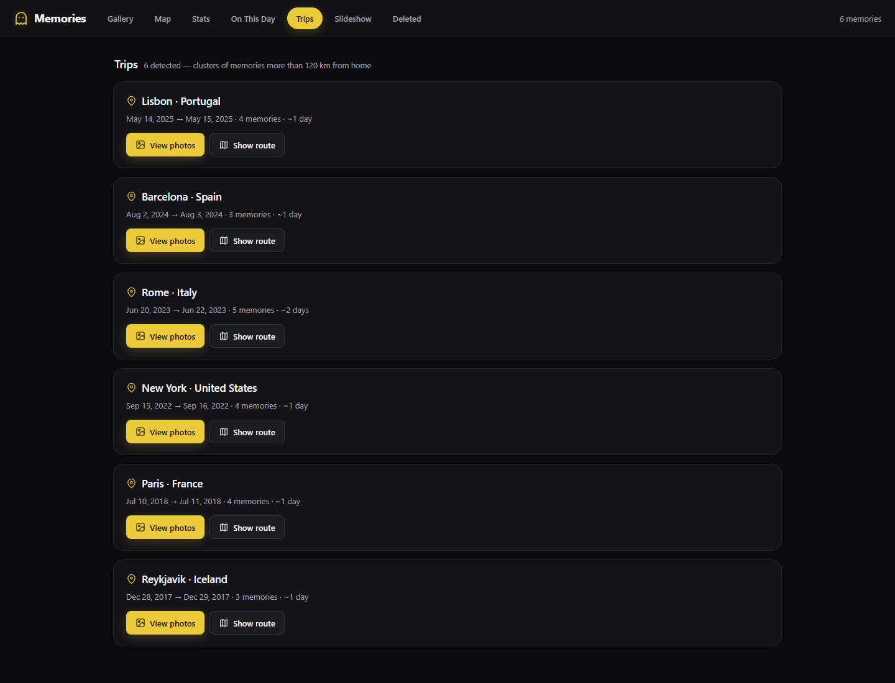
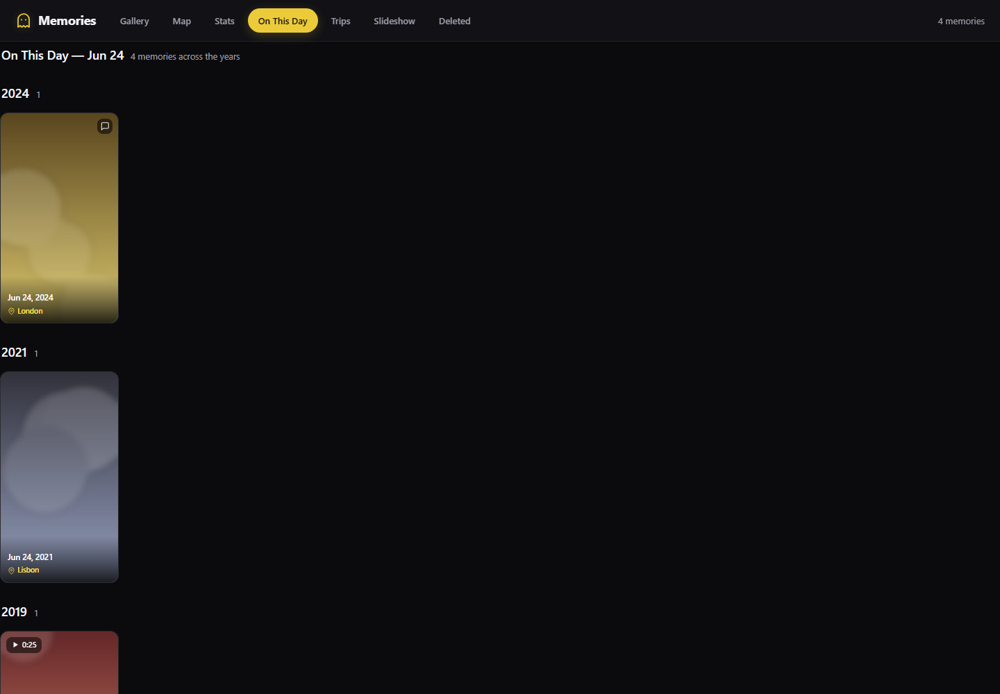

# 👻 SnapMemories Viewer

A fast, **fully local** viewer for your exported Snapchat memories. Point it at a
Snapchat *"Download My Data"* export and it turns thousands of loose photos and
videos into a browsable gallery — with a world map, statistics, automatic trip
detection, an "On This Day" timeline, and a slideshow. Everything lives in a
clean, modern dark interface with consistent SVG iconography and tabular,
data-friendly typography.

**Your photos, videos, and metadata never leave your computer.** There is no
server, no account, and nothing is uploaded. The viewer is a plain HTML page you
open by double-clicking. The only network request the app ever makes is for the
background map tiles on the Map and Trips views — and only the map's viewport
coordinates are sent, never your media or personal data. Everything else works
with the internet disconnected.

> The screenshots below were generated from a small **synthetic demo dataset**
> (random gradients + fake locations), not real memories.



---

## What it does

| | |
|---|---|
| **Gallery** | Scroll every memory as a thumbnail grid. Sort by date; filter by type (photo/video), year, place, date range, "has caption", or "has location". Click any item to open it full-size. |
| **Map** | Every geotagged memory as clustered pins over a world map, with a Heatmap toggle. Click a pin to preview and open. |
| **Stats** | Totals, photos vs videos, year span, places & countries visited, busiest day, and charts by year / month / weekday / hour, plus a per-year activity calendar. |
| **On This Day** | Memories taken on today's calendar date across every year. |
| **Trips** | Automatically detected travel away from home, with date ranges, photo counts, and a "Show route" mini-map per trip. |
| **Slideshow** | Full-screen auto-advancing playback of whatever the current filters show. |
| **Delete (reversibly)** | Remove memories you don't want. They're **moved** to a `Deleted Memories/` folder, never permanently deleted, and can be restored. |

### Lightbox

Open any item full-size. Videos play; Snapchat captions are composited back on
top of the photo, exactly as they were saved. Metadata (date, place, coordinates)
shows underneath, with a jump-to-map button.



### Map



### Stats



### Trips & On This Day

Trips are detected automatically: the app finds your "home" cells, then groups
runs of memories more than 120 km away into trips.

| Trips | On This Day |
|---|---|
|  |  |

---

## How it works

```
Snapchat "Download My Data" export
        │
        ▼
   build.py  ──►  • reads json/memories_history.json (date, type, location)
                  • pairs each *-main.{jpg,mp4} with its *-overlay.png caption
                  • reverse-geocodes coordinates OFFLINE → city + country
                  • generates ~400px thumbnails (Pillow / ffmpeg)
        │
        ▼
   viewer/data.js  +  thumbs/   ──►  viewer/index.html  (static, opens in any browser)
```

`build.py` writes a single metadata manifest (`viewer/data.js`) and a folder of
thumbnails. The viewer is static HTML/CSS/JS (Leaflet for the map, Chart.js for
stats — both bundled locally under `viewer/vendor/`). Full-resolution originals
are only read from `memories/` when you open an item.

---

## Getting started

### 1. Get your data from Snapchat

In the Snapchat app or on [accounts.snapchat.com](https://accounts.snapchat.com),
request **"My Data"** and choose to include your **memories** (the original media,
not just links). Unzip the export. You should have:

```
your-export/
├── json/memories_history.json   # dates, media types, locations
└── memories/                    # *-main.jpg / *-main.mp4 / *-overlay.png
```

Place this repo's files alongside that `json/` and `memories/` folder (or copy
`json/` and `memories/` into this folder).

### 2. Install the build requirements

- **Python 3** with `pip install reverse_geocoder pycountry Pillow`
- **ffmpeg / ffprobe** on your `PATH` (only needed for video thumbnails)

### 3. Build

```bash
python build.py
```

This generates `thumbs/`, `viewer/data.js`, and `viewer/geocache.json`. It is
**resumable** — existing thumbnails are skipped, so re-runs are fast. Run it again
any time you add more memories.

### 4. Open it

Double-click **`Memories Viewer.html`**. It opens `viewer/index.html` in your
default browser. No installation, no setup.

---

## Deleting memories

You can prune memories you don't want, and nothing is ever destroyed — files are
**moved** to a `Deleted Memories/` folder so you can always get them back.

1. In the viewer, open a memory and click **Delete** (click again to confirm).
   It disappears from every view immediately. A **Deleted** tab collects everything
   you've removed — click **Restore** on anything you change your mind about.
2. In the **Deleted** tab, click **Export deletion list** (saves a small
   `snapmemories-deletions.json` to your Downloads).
3. Double-click **`Apply Deletions.cmd`** (which runs `apply_deletions.py`). It
   moves those files into `Deleted Memories/` and rewrites `viewer/data.js`.

*Why two steps?* A page opened via `file://` isn't allowed to move files on disk,
so the small helper script does the actual move.

**To restore after a move:** move the files from `Deleted Memories/memories` back
into `memories/`, then re-run `python build.py`.

---

## Privacy

- **No server, no upload, no account.** Everything runs on your machine.
- **Offline reverse-geocoding.** Place names come from a local dataset bundled with
  the `reverse_geocoder` library — your coordinates are never sent anywhere.
- **Map tiles are the only network call.** Used solely while you browse the Map /
  Trips views; only viewport coordinates are sent to the tile provider.
- `viewer/data.js` and `viewer/geocache.json` contain your dates, GPS, and place
  names. They're generated locally and **git-ignored** — don't share them.

---

## Project layout

```
Memories Viewer.html      # double-click entry point (redirects to viewer/index.html)
build.py                  # builds thumbnails + data.js from a Snapchat export
apply_deletions.py        # moves deleted memories to Deleted Memories/
Apply Deletions.cmd       # Windows double-click wrapper for apply_deletions.py
VIEWER_README.md          # end-user guide (ships next to the viewer)
viewer/
├── index.html            # the app shell
├── core.js               # data model, filtering, routing
├── gallery.js map.js stats.js trips.js onthisday.js slideshow.js deleted.js lightbox.js
├── style.css
└── vendor/               # Leaflet + Chart.js (bundled locally)
docs/screenshots/         # images used in this README
```

For an end-user oriented walkthrough, see [`VIEWER_README.md`](VIEWER_README.md).
